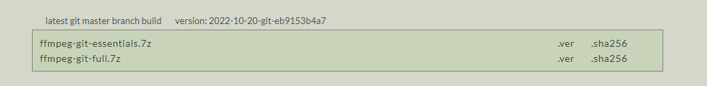

# Python desktop downloader for m3u8 videos

App build with python and kivy that executes ffmpeg to download a m3u8 video

## First install ffmpeg and add into system environment variables:
* https://www.gyan.dev/ffmpeg/builds/

#### Youtube video for more information:
https://www.youtube.com/watch?v=re_IEwXlcXU&ab_channel=JaviTuts

## Create a virtual environment and install requirements.txt

* python -m venv venv
* pip install -r requirements.txt

## Executes m3u8 downloader 🔥
*python m3u8_downloader
